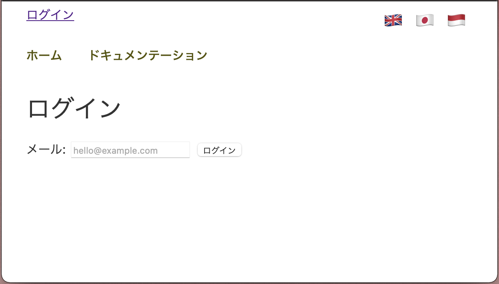

# ReactJS Starter Template

An empty starter template featuring:

- Routing for public vs logged-in routes using React Router v6
- Internationalisation using React i18next

## Installation

Create a working directory and copy the repo into it.  Then `cd` into the directory and `npm install` these modules.

```
npm install \
  history@5 \
  react-router-dom@6 \
  react-i18next \
  i18next \
  i18next-browser-languagedetector
```

Upon completion, `npm start` and you ought to see the home page in http://localhost:3000/.


If user browser language is set to a language that is supported / defined, the page ought to display text in that language.  If user browser language is not supported, then the page will fallback to English, and this can be configured in i18n.js.  To change to another language, click on the flag.



This template only uses a mock authentication, so you can enter any email to login.  Once logged-in, you will see the navigation displays additional route visible only to logged-in user.


If user types in an invalid route, React Router will recognise it as a 404.