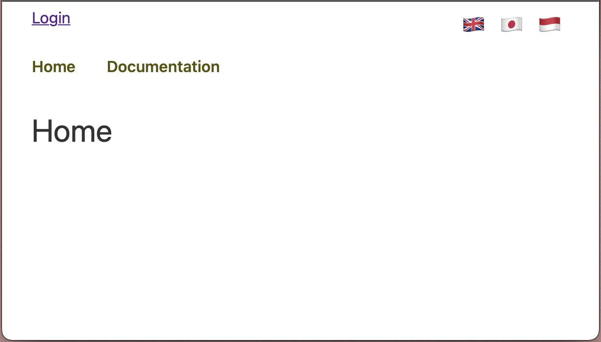

# ReactJS Starter Template

An empty starter template featuring:

- Routing for public vs logged-in routes using React Router v6
- Internationalisation using React i18next

## Installation

Create a working directory and copy the repo into it.  Then `cd` into the directory and install these modules.

`npm install history@5 react-router-dom@6 react-i18next i18next i18next-browser-languagedetector`

Upon completion, `npm start` and you ought to see the home page in http://localhost:3000/.

